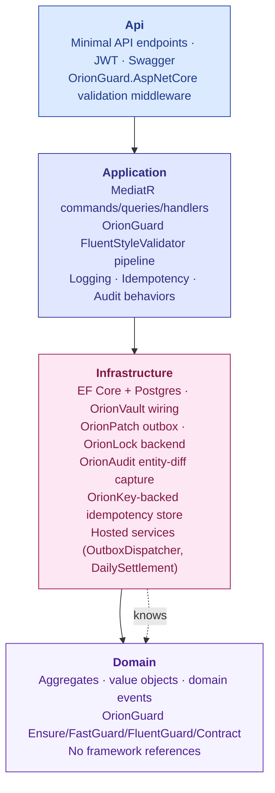
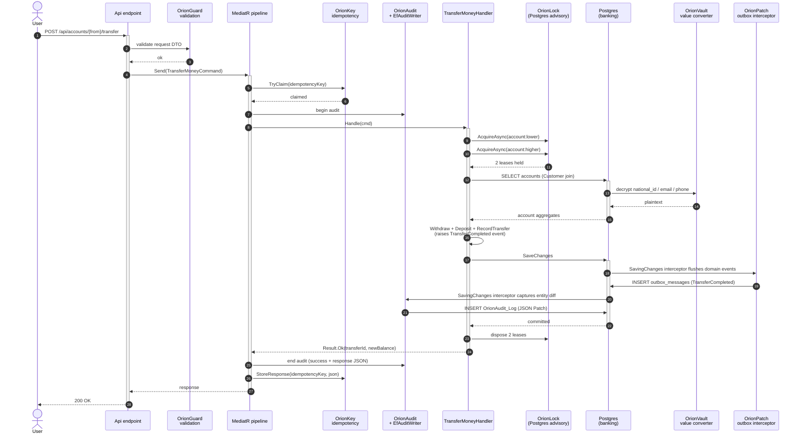
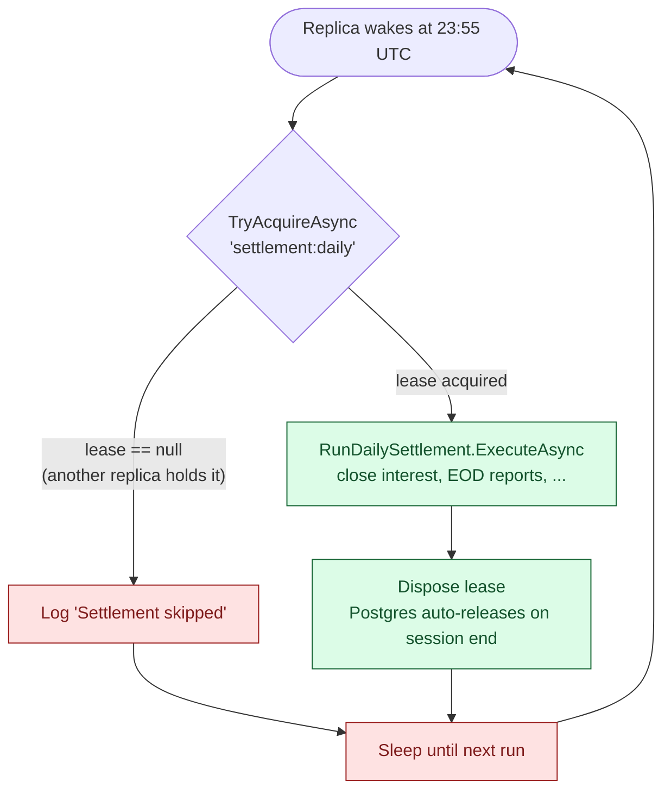
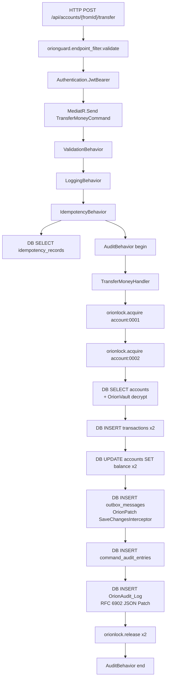

<h1 align="center">Moongazing.OrionShowcase</h1>

<p align="center">
  <strong>Production-shaped banking sample integrating all six Moongazing.Orion packages.</strong><br/>
  <em>Clean Architecture, EF Core, MediatR, OpenTelemetry. One `docker compose up` away from a working stack.</em>
</p>

<p align="center">
  
  
  
  <a href="https://github.com/tunahanaliozturk/OrionShowcase"></a>
</p>

<p align="center">
  <em>Uses:</em>
  <a href="https://github.com/tunahanaliozturk/OrionGuard">OrionGuard</a> ·
  <a href="https://github.com/tunahanaliozturk/OrionAudit">OrionAudit</a> ·
  <a href="https://github.com/tunahanaliozturk/OrionLock">OrionLock</a> ·
  <a href="https://github.com/tunahanaliozturk/OrionKey">OrionKey</a> ·
  <a href="https://github.com/tunahanaliozturk/OrionPatch">OrionPatch</a> ·
  <a href="https://github.com/tunahanaliozturk/OrionVault">OrionVault</a>
</p>

---

> **Note on the logo.** This release ships a placeholder chest glyph borrowed from OrionVault. A dedicated briefcase-with-star logo is on the roadmap for v0.1.1.

---

## What this is

OrionShowcase is a banking sample written the way a senior .NET team would write one for production: Clean Architecture, CQRS via MediatR, EF Core 9 with PostgreSQL, JWT auth, OpenTelemetry, full Docker stack. What makes it different from every other "clean architecture sample" on GitHub is that it integrates the entire Moongazing.Orion family end-to-end. Reading the code shows you what each Orion package does in a real workflow rather than in isolated quickstarts.

There is nothing in this repo that you could not have written yourself. The point is that the integrated story is much harder to assemble than any single package looks. Seeing one transfer request fan out through OrionGuard's validation, OrionKey's idempotency, OrionLock's distributed locks, OrionAudit's entity-diff capture, OrionPatch's outbox, and OrionVault's PII decryption is the whole pitch.

## Five-minute experience

```bash
git clone https://github.com/tunahanaliozturk/OrionShowcase
cd OrionShowcase
docker compose -f docker/compose.yaml up -d
```

Within about 60 seconds, four containers are healthy: api, postgres, seq, jaeger. Open these in a browser:

- `http://localhost:5000/swagger` — the API
- `http://localhost:5341` — Seq (logs)
- `http://localhost:16686` — Jaeger (traces)

In Swagger:

1. `POST /api/auth/login` with `{ "username": "demo", "password": "demo" }`. Copy the access token.
2. Click "Authorize" and paste `Bearer <token>`.
3. `POST /api/customers` to register a customer. TCKN/Email/Phone arrive as plaintext, are written to Postgres as ciphertext (verify with `psql -c "SELECT national_id FROM customers"` — you will see binary garbage).
4. `POST /api/accounts` twice to open two accounts for that customer.
5. `POST /api/accounts/{fromId}/transfer` between them.

Then in Jaeger, open the trace for that one transfer request. You will see spans from all six Orion packages alongside HTTP and EF Core spans. In Seq you will see the structured log lines from the same trace id. In Postgres you can `SELECT * FROM outbox_messages` and see the `TransferCompleted` event waiting for dispatch. This integrated trace is the central artefact this repo exists to provide.

## Architecture

Four-layer Clean Architecture with one-way dependency flow.



Tests:

- `OrionShowcase.Domain.Tests` (30 tests, xunit + FluentAssertions, no infrastructure)
- `OrionShowcase.Application.Tests` (21 tests, in-memory fakes for repositories/locks/idempotency)
- `OrionShowcase.IntegrationTests` (Testcontainers Postgres, real DI graph, end-to-end register/open/transfer + PII-at-rest verification)

## Transfer flow (one request, six packages)



Every numbered step lands as a span in Jaeger and a structured log line in Seq with the same trace id.

## What each Orion package does in this codebase

### OrionGuard — validation, guards, ProblemDetails

OrionGuard does the most work in this showcase. We use four parts of its surface area:

**Endpoint-level validation + RFC 9457 ProblemDetails middleware:**

- [`Program.cs`](src/Moongazing.OrionShowcase.Api/Program.cs) wires `AddOrionGuardAspNetCore()` and `UseOrionGuardValidation()`.
- Every command validator inherits from `Moongazing.OrionGuard.Compatibility.FluentStyleValidator<TCommand>` — the drop-in replacement for FluentValidation's `AbstractValidator<T>`. Same `RuleFor(x => x.Property).NotEmpty().MaximumLength(100)` syntax. See [`TransferMoneyValidator.cs`](src/Moongazing.OrionShowcase.Application/Accounts/Commands/TransferMoney/TransferMoneyValidator.cs) and the six sibling validators under `Application/{Customers,Accounts}/Commands/`.

**MediatR pipeline integration:**

- [`ValidationBehavior.cs`](src/Moongazing.OrionShowcase.Application/Pipeline/ValidationBehavior.cs) resolves `Moongazing.OrionGuard.Core.IValidator<TRequest>` instances from DI and runs them before each handler.

**Domain-layer guards (the part that proves we eat our own dog food):**

- `Ensure.NotNull(value, name)` and `Ensure.NotNullOrWhiteSpace(value, name)` replaced every `ArgumentNullException.ThrowIfNull` and `ArgumentException.ThrowIfNullOrWhiteSpace` call across the Domain. They preserve the standard .NET argument-exception contract so existing tests and downstream consumers see the same exception types.
- `FastGuard.NotNull` (aggressive-inlined, allocation-free) is used in hot paths like [`Money.cs`](src/Moongazing.OrionShowcase.Domain/ValueObjects/Money.cs) operator overloads.
- `Ensure.For(value, name).NotNull().Must(...).MinLength(...).Email(...).Build()` fluent chains appear in [`Customer.Register`](src/Moongazing.OrionShowcase.Domain/Customers/Customer.cs), [`Tckn`](src/Moongazing.OrionShowcase.Domain/ValueObjects/Tckn.cs) constructor, and [`Account.Deposit`](src/Moongazing.OrionShowcase.Domain/Accounts/Account.cs).
- `Contract.Requires(condition, message)` and `Contract.Invariant(condition, message)` express Design-by-Contract style domain invariants in [`Account.Open`](src/Moongazing.OrionShowcase.Domain/Accounts/Account.cs) (opening deposit non-negative), `Account.RecordTransfer` (counterparty != self), `Money` `operator -` (no negative result), `Iban` (mod-97 checksum), `Tckn` (10th and 11th digit checksums).

**Why we use OrionGuard's validator and not FluentValidation:** consistency with our own pitch. If a showcase for the Orion family ships with a competing validation library, why would a reader trust the recommendation? The FluentStyleValidator base class is API-compatible — `RuleFor(x => x.Foo).NotEmpty()` works unchanged. Migration was a `using` change.

### OrionAudit — automatic entity-diff capture

OrionAudit installs a SaveChangesInterceptor on `BankingDbContext` that records every INSERT/UPDATE/DELETE on opted-in entity types as RFC 6902 JSON Patch documents in an `OrionAudit_Log` table.

- [`InfrastructureServiceCollectionExtensions.cs`](src/Moongazing.OrionShowcase.Infrastructure/DependencyInjection/InfrastructureServiceCollectionExtensions.cs) calls `AddOrionAudit<BankingDbContext>(o => o.Audit<Account>().Audit<Customer>().Audit<Transaction>())`.
- [`BankingDbContext.OnModelCreating`](src/Moongazing.OrionShowcase.Infrastructure/Persistence/BankingDbContext.cs) calls `ApplyOrionAuditConfigurations(this)` to map the audit log, snapshot cursor, and capture queue tables.
- The DbContext options builder calls `UseOrionAudit(sp)` so the interceptor runs on every save.

In addition to OrionAudit's entity-level diff stream, [`EfAuditWriter.cs`](src/Moongazing.OrionShowcase.Infrastructure/Audit/EfAuditWriter.cs) records command-level audit rows (actor, action, request JSON, response JSON, succeeded, errorMessage) into a separate `command_audit_entries` table. The two streams are complementary: OrionAudit answers "what changed in this row over time" and `EfAuditWriter` answers "who invoked which command and what happened".

### OrionLock — distributed locks with Postgres advisory backend

Two locking patterns demonstrate OrionLock:

**Sorted-key deadlock prevention in money transfer:**

[`TransferMoneyHandler.cs`](src/Moongazing.OrionShowcase.Application/Accounts/Commands/TransferMoney/TransferMoneyHandler.cs) acquires distributed locks on both source and target account ids. To prevent the classic two-process-cross-deadlock, both locks are acquired in sorted Guid order so that concurrent transfers between the same two accounts always queue rather than deadlock.

**Single-instance hosted job:**

[`DailySettlementService.cs`](src/Moongazing.OrionShowcase.Infrastructure/HostedServices/DailySettlementService.cs) is a `BackgroundService` that wakes at 23:55 UTC. Before doing any work it calls `TryAcquireAsync("settlement:daily")`. If the lock is already held (because another replica got there first), the service logs `Settlement skipped` and goes back to sleep. This is the standard pattern for daily jobs that must run exactly once across N horizontally-scaled API replicas.



Backend: `OrionLock.Postgres` 0.2.3 uses Postgres `pg_try_advisory_lock` with session-scoped semantics — if the holding process crashes, Postgres auto-releases the lock when the session ends.

### OrionKey — Snowflake IDs and idempotency

OrionKey 0.4.1 exposes a process-global static facade rather than a DI service. `OrionKey.Configure(o => o.SnowflakeWorkerId = ...)` runs once at startup. Then `OrionKey.NextSnowflake()` is called wherever a 64-bit time-sortable id is needed.

- [`EfAuditWriter.cs`](src/Moongazing.OrionShowcase.Infrastructure/Audit/EfAuditWriter.cs) uses `OrionKey.NextSnowflake()` for `CommandAuditEntry.Id` so audit rows are naturally time-ordered without an autoincrement collision risk across replicas.
- [`OrionKeyIdempotencyStore.cs`](src/Moongazing.OrionShowcase.Infrastructure/Idempotency/OrionKeyIdempotencyStore.cs) implements Application's `IIdempotencyStore` against an EF-backed `idempotency_records` table. (OrionKey 0.4.1 does not yet expose a built-in idempotency cache — the package focuses on ID generation. The integration here is "use OrionKey for the surrogate id; do the cache with EF".)
- The `IdempotencyBehavior<TRequest, TResponse>` MediatR pipeline behavior calls into `IIdempotencyStore` so any command implementing `IIdempotentCommand` is automatically deduplicated by `IdempotencyKey`.

### OrionPatch — transactional outbox

OrionPatch's `SaveChangesInterceptor` collects events queued via `IOutbox.Enqueue<T>(...)` into an `outbox_messages` table inside the same database transaction as the domain changes. A hosted dispatcher later pushes them to configured sinks.

[`DomainEventOutboxAdapter.cs`](src/Moongazing.OrionShowcase.Infrastructure/Outbox/DomainEventOutboxAdapter.cs) is the small bridge that walks the EF change tracker, finds entities deriving from `AggregateRoot<TId>`, and enqueues each accumulated domain event via reflection on `IOutbox.Enqueue<T>` so the concrete event type reaches `MessageTypeNameResolver`. Three-phase lifecycle (SavingChanges -> SavedChanges -> SaveChangesFailed) preserves at-least-once semantics across save failures.

[`BankingDbContext.OnModelCreating`](src/Moongazing.OrionShowcase.Infrastructure/Persistence/BankingDbContext.cs) calls `ApplyOrionPatchConfiguration(this)` to map the outbox row table. [`InfrastructureServiceCollectionExtensions`](src/Moongazing.OrionShowcase.Infrastructure/DependencyInjection/InfrastructureServiceCollectionExtensions.cs) calls `AddOrionPatch().UseEntityFrameworkCore<BankingDbContext>()` and the DbContext options call `UseOrionPatch(sp)`.

A single `TransferCompleted` event is raised by `Account.RecordTransfer` in the Domain, ends up in `outbox_messages` in the same transaction as the balance debit/credit, and gets dispatched asynchronously by the OrionPatch hosted service. No two-phase commit, no event loss.

### OrionVault — column encryption at rest

Customer PII (NationalId, Email, Phone) is encrypted at the database column level. The DB sees ciphertext; application code sees plaintext.

- [`CustomerConfiguration.cs`](src/Moongazing.OrionShowcase.Infrastructure/Persistence/Configurations/CustomerConfiguration.cs) marks the three columns with `HasAnnotation("OrionVault:Encrypted", true)`. (The typed `.IsEncrypted()` extension only supports `PropertyBuilder<string>` and `PropertyBuilder<byte[]>` directly. We use the underlying annotation for our value-converted `Tckn` type so the OrionVault model customizer picks it up.)
- [`InfrastructureServiceCollectionExtensions.cs`](src/Moongazing.OrionShowcase.Infrastructure/DependencyInjection/InfrastructureServiceCollectionExtensions.cs) wires `AddOrionVault(o => { o.UseStaticKeys(...); }).UseEntityFrameworkCore<BankingDbContext>()` and the DbContext options call `UseOrionVault(sp)`.
- At-rest verification: [`PiiEncryptionTests.cs`](test/Moongazing.OrionShowcase.IntegrationTests/Scenarios/PiiEncryptionTests.cs) reads `national_id` directly from Postgres as raw bytes via Npgsql and confirms the on-disk layout is `[keyId(2 BE) | nonce(12) | tag(16) | ciphertext]` — the 30-byte fixed overhead documented in OrionVault's spec.

## Where we deliberately use packages from outside the Orion family

Honesty section. Not every component in the stack has an Orion equivalent, and the ones below are industry standards we use without apology:

- **MediatR** for CQRS — no Orion equivalent (yet). MediatR is the de-facto standard.
- **OpenTelemetry SDK + OTLP exporter** for traces and metrics — open standard, exports Orion ActivitySources/Meters to Jaeger.
- **Microsoft.AspNetCore.Authentication.JwtBearer** for JWT validation — in-box, no Orion equivalent.
- **Microsoft.AspNetCore.RateLimiting** for per-endpoint rate limits — OrionGuard.AspNetCore 6.4.2 is a validation + ProblemDetails package, not a rate limiter. The policy names in `appsettings.json` are prefixed with `OrionGuard:Policies` for narrative consistency, but the actual middleware is ASP.NET Core's in-box one.
- **Swashbuckle.AspNetCore** for Swagger UI / OpenAPI generation.
- **Serilog** + Seq sink for structured logging.
- **EF Core 9 + Npgsql** for persistence.
- **Testcontainers.PostgreSql** for integration test isolation.

If a future Orion package ships any of the above (a saga library, an OIDC integration, a tracing exporter), the showcase swaps to it.

## Where each Orion package wires in (component map)

```mermaid
flowchart LR
    subgraph Api["Api layer"]
        Prog[Program.cs]
        Endp[Endpoints]
        Jwt[JwtBearer]
    end

    subgraph App["Application layer"]
        Cmd[Commands +<br/>Handlers]
        Pipe[MediatR<br/>pipeline]
        Val[FluentStyleValidators]
    end

    subgraph Infra["Infrastructure layer"]
        Ctx[BankingDbContext]
        Repo[Repositories]
        Adp[DomainEventOutboxAdapter]
        Hsv[DailySettlementService]
        Aud[EfAuditWriter]
        Ids[OrionKeyIdempotencyStore]
    end

    subgraph Dom["Domain layer"]
        Agg[Account +<br/>Customer aggregates]
        Vo[Value objects]
    end

    OG[OrionGuard<br/>+ AspNetCore]:::orion
    OA[OrionAudit]:::orion
    OL[OrionLock.Postgres]:::orion
    OK[OrionKey]:::orion
    OP[OrionPatch.EFCore]:::orion
    OV[OrionVault.EFCore]:::orion

    Prog -.UseOrionGuardValidation.-> OG
    Val -.FluentStyleValidator.-> OG
    Pipe -.ValidationBehavior.-> OG
    Agg -.Ensure/Contract/FluentGuard.-> OG

    Ctx -.UseOrionAudit / Audit entity diff.-> OA
    Aud -.command-level audit rows.-> OA

    Cmd -.IDistributedLock.AcquireAsync.-> OL
    Hsv -.TryAcquireAsync settlement:daily.-> OL

    Aud -.NextSnowflake.-> OK
    Ids -.snowflake IDs +<br/>EF-backed cache.-> OK

    Adp -.IOutbox.Enqueue domain events.-> OP
    Ctx -.UseOrionPatch interceptor.-> OP

    Ctx -.UseOrionVault interceptor.-> OV
    Repo -.ciphertext on disk,<br/>plaintext to handlers.-> OV

    classDef orion fill:#e0e7ff,stroke:#312e81,color:#1e1b4b,stroke-width:2px
```

Every arrow is a real line of code in this repo. Click through to the file links in the previous section to see them.

## OpenTelemetry trace anatomy

A single `POST /api/accounts/{fromId}/transfer` request produces this span tree (visible in Jaeger).



Activity sources exported: `Moongazing.OrionGuard`, `OrionAudit`, `Moongazing.OrionLock`, `Moongazing.OrionPatch`, `Moongazing.OrionVault`. OrionKey 0.4.1 currently exposes only a Meter, no ActivitySource — `orionkey.snowflake.generated` counter is visible in Jaeger's metrics view.

## Tech stack

- .NET 8, ASP.NET Core 8 Minimal API
- EF Core 9.0.1 + Npgsql.EntityFrameworkCore.PostgreSQL 9.0.4
- PostgreSQL 16 (alpine)
- MediatR 12.4.1
- OrionGuard 6.4.2, OrionGuard.AspNetCore 6.4.2
- OrionAudit 0.6.2
- OrionLock 0.2.3, OrionLock.Postgres 0.2.3
- OrionKey 0.4.1
- OrionPatch 0.1.1, OrionPatch.EntityFrameworkCore 0.1.1
- OrionVault 0.1.2, OrionVault.EntityFrameworkCore 0.1.2
- OpenTelemetry 1.15.3 (Hosting + OTLP exporter + AspNetCore + EFCore + Npgsql)
- Serilog.AspNetCore + Serilog.Sinks.Seq
- Swashbuckle.AspNetCore
- xUnit + FluentAssertions + Testcontainers.PostgreSql

## Known limitations

- Authentication is a dev-grade JWT issuer with hardcoded `demo`/`demo` user. Real deployments swap in OIDC (Keycloak, IdentityServer, Auth0).
- Single Account aggregate. Loan, KYC, multi-tenant slices are roadmap items.
- API only — no Blazor / SPA frontend.
- No Kubernetes manifests. Docker compose ships; Helm chart is roadmap.
- OrionKey 0.4.1 exposes a process-global static facade for Snowflake configuration. Multi-tenant or per-host worker-id rotation is roadmap material in OrionKey itself.

## Roadmap

See [ROADMAP.md](ROADMAP.md). Highlights:

- v0.2: Loan aggregate, cross-aggregate saga via outbox
- v0.3: Multi-tenant slice with OrionVault per-tenant key partitioning
- v0.4: gRPC variant (Moongazing.OrionGuard.Grpc demo)
- v1.0: OIDC integration, Blazor admin frontend, Helm chart, OrionFlow saga (when it ships)

## Family

| Package | Role |
|---|---|
| [Moongazing.OrionGuard](https://github.com/tunahanaliozturk/OrionGuard) | Guard clauses, fluent validation, ProblemDetails |
| [Moongazing.OrionAudit](https://github.com/tunahanaliozturk/OrionAudit) | Automatic entity-diff capture (JSON Patch) |
| [Moongazing.OrionLock](https://github.com/tunahanaliozturk/OrionLock) | Distributed locks (Postgres/SqlServer/Redis backends) |
| [Moongazing.OrionKey](https://github.com/tunahanaliozturk/OrionKey) | Snowflake IDs and GUID v7 generators |
| [Moongazing.OrionPatch](https://github.com/tunahanaliozturk/OrionPatch) | Transactional outbox for EF Core |
| [Moongazing.OrionVault](https://github.com/tunahanaliozturk/OrionVault) | Column encryption at rest (AES-256-GCM) |

## License

MIT. See [LICENSE](LICENSE).

## Contributing

Issues and pull requests welcome. There is no `CONTRIBUTING.md` yet; for now, please open an issue first if your change touches more than one file or the public API surface, so we can align on the approach.
